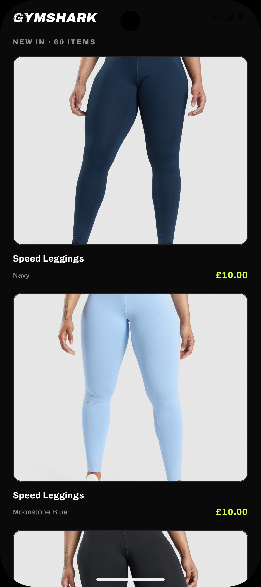
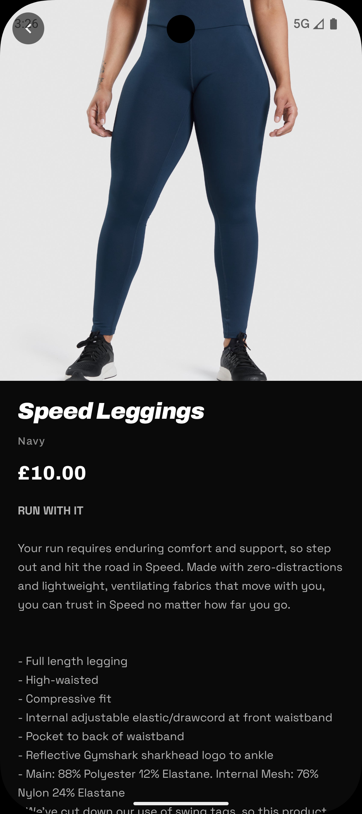
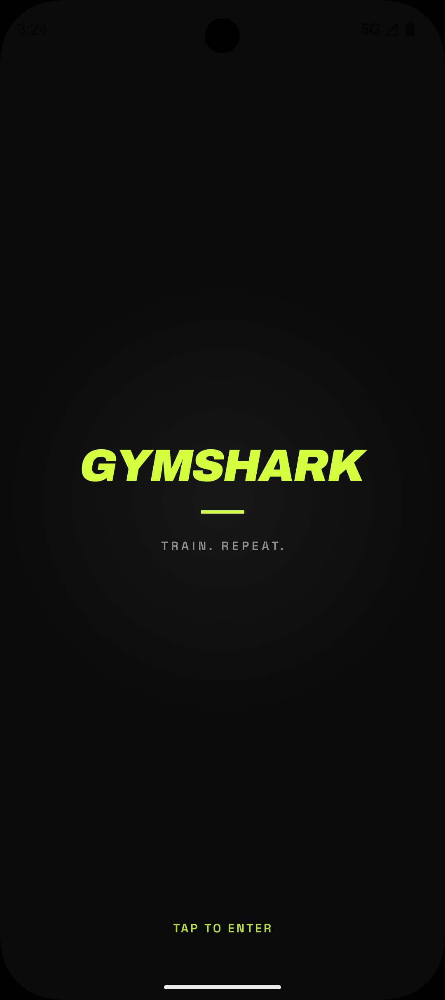

# Gymshark Shop

A small Android app that fetches a product catalogue from a remote JSON endpoint and
presents it as a browsable product list with a detail screen. Built with Jetpack Compose
and an MVVM architecture.

## Features

- Fetches and parses the product payload from the Gymshark mock endpoint.
- Product list with image, title, price, colour and label indicators.
- Graceful handling of missing or broken product images (fallback tile).
- Product labels (e.g. *going fast*, *new*, *recycled nylon*) rendered as badges.
- Detail screen with the full image, price, colour, labels and the product
  description rendered from HTML (not shown as raw tags).
- Loading, empty and error states, with retry on failure.

## Screenshots

|                          Product list                          |                          Product detail                          |                          Splash                           |
|:--------------------------------------------------------------:|:----------------------------------------------------------------:|:---------------------------------------------------------:|
|  |  |  |


## Architecture

Single module, organised by layer:

```
com.demis.gymsharkshop
├── data          # DTOs, Retrofit API, mapper, repository implementation
├── domain        # Product model, ProductLabel, repository interface, result type
├── di            # Hilt modules (network, repository)
└── presentation  # Compose UI, ViewModels, UI state, navigation, theme
```
